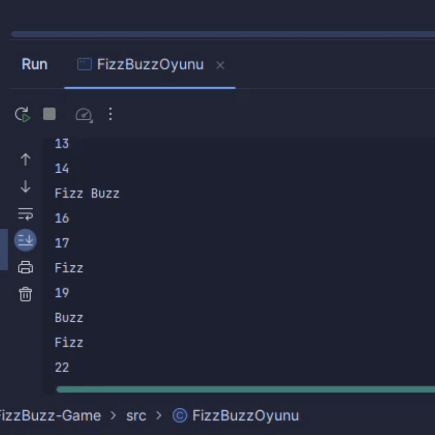

<h1 align="center" id="title">FizzBuzz-Game</h1>

Fizz Buzz oyunu çocuklara çarpmada katları öğretmek amaçlı kullanılan bir oyundur. Eğer sayı üçün katı ise FİZZ eğer sayı beşin katıysa BUZZ eğer sayı on beşin katıysa FİZZBUZZ diye öğrenciler bağırır. Bu uygulamada üç beş ve 15 in katları FİZZ BUZZ FİZZBUZZ kelimeleriyle yer değiştirilerek sunulmuştur.

  
  
<h2>🧐 Features</h2>

*   Üç ve üçün katları Fizz
*   Beş ve beşin katları Buzz
*   On beş ve on beşin katları FizzBuzz olarak ekrana çıktı verir

  
  
<h2>💻 Built with</h2>

*   JAVA
<h2>📸Project Screenshot</h2>

<h2>📸Project Gifs</h2>

